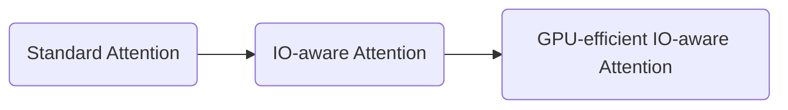

$$
\operatorname{Attention}(Q, K, V)
=
\operatorname{softmax}\left(\frac{QK^\top}{\sqrt d}\right)V.
$$

FlashAttention 并没有把 dense attention 从 $O(N^2d)$ 变成线性复杂度，也没有引入低秩、稀疏或核函数近似；FlashAttention-2 同样没有改变 Attention 的数学定义。两篇论文真正解决的是两个连续的系统问题：

| 方法 | 核心问题 | 主要优化层次 |
|:-:|---|:-:|
| Standard Attention | 直接按算子执行，产生大量 $N^2$ 中间结果 |  |
| FlashAttention | 同样计算 exact attention，如何显著减少 HBM 数据搬运 | HBM $\leftrightarrow$ SRAM |
| FlashAttention-2 | IO 已经优化后，如何进一步提高 GPU 利用率 | Thread Block / Warp / Tensor Core |

因此，理解 FlashAttention 系列最重要的视角不是“减少了多少 FLOPs”，而是：



## Attention 的性能瓶颈

设单个 attention head 的

$$
Q, K, V\in\mathbb R^{N\times d}.
$$

标准 Attention 可以写成：

$$
S =\frac{QK^\top}{\sqrt d},\qquad
P =\operatorname{softmax}(S),\qquad
O = PV,
$$

其中

$$
S, P\in\mathbb R^{N\times N}.
$$

从算法复杂度看，两次主要矩阵乘都需要 $O(N^2d)$ FLOPs，因此很容易得到“Attention 慢是因为 $N^2$ FLOPS 计算量太大”的结论。但在真实 GPU 上，kernel 的时间不仅取决于计算量，还取决于数据在内存层次之间移动的代价。

标准实现通常经历：

$$
Q, K
\rightarrow QK^\top
\rightarrow \text{HBM}
\rightarrow \text{softmax/mask}
\rightarrow \text{HBM}
\rightarrow PV.
$$

也就是说，完整的 $S$ 和 $P$ 往往会被 materialize 到 HBM，然后再次读回。对于长序列，这两个 $N\times N$ 中间矩阵会迅速成为显存带宽和 activation memory 的主要负担。

以 A100 为例，HBM 容量很大、带宽约为 TB/s 量级，而每个 SM 的片上 SRAM 容量只有数百 KB，却拥有远高于 HBM 的带宽。于是 GPU kernel 大致可分为两类：大型 GEMM 往往具有较高 arithmetic intensity，更接近 compute-bound；softmax、mask、dropout、reduction 等操作 FLOPs 很少，但需要反复读取和写回数据，更容易 memory-bound。

对 memory-bound workload，更合理的性能模型是：

$$
T\approx
\frac{\text{Bytes transferred}}
{\text{Memory bandwidth}},
$$

而不是只看 FLOPs。FlashAttention 的核心出发点正是：**Attention 的主要瓶颈之一，是 $N^2$ 中间矩阵造成的 HBM IO。**

## FlashAttention

FlashAttention 的核心目标是

$$
\boxed{
QK^\top\text{ 仍然计算，但完整 }S\text{ 不写入 HBM}
}
$$

$$
\boxed{
\operatorname{softmax}(S)\text{ 仍然精确计算，但完整 }P\text{ 不写入 HBM}
}
$$

它把 $Q,K,V$ 切成能够放入片上 SRAM 的 tile，在片上完成局部 score 计算、softmax、mask、dropout 和 $PV$ 累积。局部的 $S_{ij}$、$P_{ij}$ 使用完立即丢弃，从而避免完整 $N\times N$ 矩阵的 materialization。

真正困难的地方不是矩阵乘，而是 softmax。矩阵乘天然可以分块：

$$
S_{ij}= Q_iK_j^\top,
$$

但一行 softmax 的归一化依赖整行所有元素。FlashAttention 能够分块计算 exact softmax，依赖的就是 **online softmax**。

### Online Softmax

考虑一行 score：

$$
s = [s_1, s_2,\dots, s_N].
$$

为了数值稳定，softmax 通常写成：

$$
m =\max_j s_j,\qquad
\ell =\sum_j e^{s_j-m},
$$

$$
p_j =\frac{e^{s_j-m}}{\ell}.
$$

如果 SRAM 中一次只能看到一个 score block，我们暂时不知道最终全局最大值 $m$，也不知道最终 denominator $\ell$。关键观察是：当新的更大最大值出现时，旧的指数和不需要重新计算，只需要重新缩放。

假设已经处理过一部分 scores，保存：

$$
m_{\text{old}},
\qquad
\ell_{\text{old}}
=
\sum_{\text{old}}e^{s-m_{\text{old}}}.
$$

新 block $S_b$ 的局部最大值为：

$$
m_b =\operatorname{rowmax}(S_b),
$$

新的全局最大值：

$$
m_{\text{new}}
=
\max(m_{\text{old}}, m_b).
$$

由于

$$
e^{s-m_{\text{new}}}
=
e^{s-m_{\text{old}}}
e^{m_{\text{old}}-m_{\text{new}}},
$$

旧 denominator 可以直接重标定：

$$
\ell_{\text{new}}
=
e^{m_{\text{old}}-m_{\text{new}}}\ell_{\text{old}}
+
\sum_{s\in S_b}e^{s-m_{\text{new}}}.
$$

因此，完整 softmax 不需要保存完整 score row，只需要持续维护 row-wise 的 $m$ 和 $\ell$。

### FlashAttention 前向过程

论文 Algorithm 1 的输入是：

$$
Q, K, V\in\mathbb R^{N\times d},
$$

它们存放在 HBM 中，同时假设片上 SRAM 可用容量为 $M$。算法首先选择行、列 tile 大小 $B_r,B_c$，使正在处理的 $Q_i,K_j,V_j$、局部 score 以及必要的统计量能够放进 SRAM。

随后把：

$$
Q\rightarrow Q_1,\dots, Q_{T_r},
\qquad
K, V\rightarrow
(K_1, V_1),\dots,(K_{T_c}, V_{T_c}),
$$

其中

$$
Q_i\in\mathbb R^{B_r\times d},
\qquad
K_j, V_j\in\mathbb R^{B_c\times d},
$$

并有：

$$
T_r =\left\lceil\frac{N}{B_r}\right\rceil,\qquad
T_c =\left\lceil\frac{N}{B_c}\right\rceil.
$$

算法为每个 query row 维护三个状态：

$$
\boxed{O_i,\quad m_i,\quad \ell_i}.
$$

初始化为：

$$
O_i = 0,\qquad
m_i =-\infty,\qquad
\ell_i = 0.
$$

其中 $m_i$ 表示目前见过的最大 score，$\ell_i$ 表示对应数值稳定形式下的 softmax denominator，$O_i$ 表示目前累计得到的归一化 attention 输出。

第一版 FlashAttention 的循环顺序是：

```text
for each K_j, V_j block:
    load K_j, V_j from HBM to SRAM

    for each Q_i block:
        load Q_i, O_i, m_i, l_i
        compute S_ij = Q_i @ K_j^T
        update online-softmax statistics
        update O_i with V_j
        write O_i, m_i, l_i back
```

外层固定一个 $K_j,V_j$ block，内层让所有 $Q_i$ 依次与它计算。这样一个已经搬入 SRAM 的 K/V tile 能被多个 Q tile 复用，减少重复的 HBM 访问。

对于当前 tile，首先计算：

$$
S_{ij}= Q_iK_j^\top
\in\mathbb R^{B_r\times B_c}.
$$

实际 Transformer 中还包含 $1/\sqrt d$ 缩放、causal mask 等操作，这些都可以融合进 tile 内计算，而不需要额外 materialize 一个大矩阵。

然后对每一行计算当前 tile 的局部统计量：

$$
\tilde m_{ij}
=
\operatorname{rowmax}(S_{ij}),
$$

$$
\tilde P_{ij}
=
\exp(S_{ij}-\tilde m_{ij}),
$$

$$
\tilde\ell_{ij}
=
\operatorname{rowsum}(\tilde P_{ij}).
$$

这里的 $\tilde P_{ij}$ 还不是最终归一化后的 softmax probability，因为当前只处理了一个 K/V block。

接下来将旧状态与当前 block 合并。新的最大值：

$$
m_i^{\text{new}}
=
\max(m_i,\tilde m_{ij}),
$$

新的 denominator：

$$
\boxed{
\ell_i^{\text{new}}
=
e^{m_i-m_i^{\text{new}}}\ell_i
+
e^{\tilde m_{ij}-m_i^{\text{new}}}\tilde\ell_{ij}
}
$$

这一步就是 online softmax 的 row-wise recurrence。

仅更新 denominator 还不够，因为 Attention 最终需要的是 $PV$。对于一行 query，当前输出可以写成：

$$
O
=
\frac{
\sum_j e^{s_j-m}v_j
}{
\sum_j e^{s_j-m}
}.
$$

如果旧结果已经是归一化后的 $O_i$，那么旧 numerator 实际上是：

$$
\ell_i O_i.
$$

当最大值从 $m_i$ 更新为 $m_i^{\text{new}}$ 后，旧 numerator 必须按照同一尺度重新缩放；当前 block 的 value contribution 也要转换到新尺度。因此：

$$
\boxed{
O_i^{\text{new}}
=
\frac{
e^{m_i-m_i^{\text{new}}}\ell_i O_i
+
e^{\tilde m_{ij}-m_i^{\text{new}}}\tilde P_{ij}V_j
}{
\ell_i^{\text{new}}
}
}
$$

论文伪代码中的 `diag` 只是把每一行各自的 $\ell_i$ 写成矩阵形式，本质就是上面的 row-wise 更新。

这一递推始终维持三个不变量。处理到第 $j$ 个 K/V block 时：

$$
m_i^{(j)}
=
\max_{k\le jB_c}s_{ik},
$$

$$
\ell_i^{(j)}
=
\sum_{k\le jB_c}
e^{s_{ik}-m_i^{(j)}},
$$

$$
O_i^{(j)}
=
\frac{
\sum_{k\le jB_c}
e^{s_{ik}-m_i^{(j)}}v_k
}{
\ell_i^{(j)}
}.
$$

当所有 K/V blocks 处理完成后，$O_i$ 就与一次性计算完整 softmax 后的结果完全相同。

这也解释了为什么 FlashAttention 可以“边算边丢”。一个局部 tile 的生命周期是：

$$
Q_iK_j^\top
\rightarrow
\tilde P_{ij}
\rightarrow
\tilde P_{ij}V_j
\rightarrow
\text{update }(O_i, m_i,\ell_i)
\rightarrow
\text{discard}.
$$

完整的 $S,P\in\mathbb R^{N\times N}$ 从未需要出现在 HBM 中。

### Tiling、Fusion 与 Backward Recomputation

FlashAttention 的 tiling 与 kernel fusion 是同一件事的两个侧面。标准 Attention 可能跨多个 kernel 依次执行：

$$
QK^\top
\rightarrow
\text{HBM}
\rightarrow
\text{mask}
\rightarrow
\text{HBM}
\rightarrow
\text{softmax}
\rightarrow
\text{HBM}
\rightarrow
\text{dropout}
\rightarrow
\text{HBM}
\rightarrow
PV.
$$

FlashAttention 则把：

$$
Q_iK_j^\top
\rightarrow
\text{mask}
\rightarrow
\text{softmax}
\rightarrow
\text{dropout}
\rightarrow
P_{ij}V_j
$$

尽可能融合在同一个 kernel 的片上执行路径中。online softmax 使 tile 可以独立推进，tiling 又使 $N^2$ 中间矩阵无需落到 HBM，从而为 aggressive fusion 创造条件。

训练时 backward 更能体现“IO 优先”的设计思路。标准 Attention backward 涉及：

$$
dV = P^\top dO,\qquad
dP = dOV^\top,
$$

$$
dS
=
P\odot
\left(
dP-\operatorname{rowsum}(P\odot dP)
\right),
$$

以及：

$$
dQ = dSK,\qquad
dK = dS^\top Q.
$$

最直接的实现会在 forward 保存完整 $P$，导致 $O(N^2)$ activation memory。FlashAttention 选择不保存 $P$，而是在 backward 重新计算：

$$
S_{ij}= Q_iK_j^\top,
$$

再利用 forward 保存的 normalization statistics 重建：

$$
P_{ij}.
$$

因此 FlashAttention 的一个关键工程原则是：

$$
\boxed{\text{recomputation can be cheaper than HBM access}}
$$

也就是：如果重新计算主要发生在 Tensor Core、register 和 SRAM 中，而它替代的是大量 HBM 读写，那么增加 FLOPs 反而可能缩短 wall-clock time。

Softmax backward 还有一个重要化简。定义：

$$
D_i =\sum_jP_{ij}dP_{ij}.
$$

由于：

$$
O_i = P_iV,\qquad
dP_i = dO_iV^\top,
$$

可以得到：

$$
\boxed{D_i = O_i\cdot dO_i}.
$$

于是局部 backward 可写成：

$$
dS_{ij}
=
P_{ij}\odot(dP_{ij}-D_i),
$$

其中 $D_i$ 只需要长度 $d$ 的输出与梯度即可得到，不需要保存长度 $N$ 的完整 probability row。这进一步使 backward 适合 tiled execution。

### 复杂度

FlashAttention 没有改变 dense attention 的主计算复杂度：

$$
\boxed{\text{FLOPs}= O(N^2d)}.
$$

它改变的是中间存储和 HBM IO。完整的 $S,P$ 不再需要 materialize；额外 row-wise statistics 只需要 $O(N)$ 规模，而必要的输入输出仍保持原本的 $O(Nd)$。

论文给出的 HBM IO complexity 对比为：

$$
\text{Standard Attention}:
\Theta(Nd+N^2),
$$

$$
\text{FlashAttention}:
\Theta\left(\frac{N^2d^2}{M}\right),
$$

其中 $M$ 表示可用 SRAM capacity 参数。在典型 head dimension 和合适 tile 大小时，后者显著减少 HBM traffic。

论文中的一组 GPT-2 medium 实验

| 指标 | Standard Attention | FlashAttention |
|:-:|:--:|:--:|
| GFLOPs | 66.6 | **75.2** |
| HBM R/W | 40.3 GB | **4.4 GB** |
| Forward + Backward | 41.7 ms | **7.3 ms** |

FlashAttention 的 FLOPs 甚至更多，但 HBM 读写从 40.3 GB 降到 4.4 GB，运行时间反而从 41.7 ms 降到 7.3 ms。这个结果很好地说明了 FlashAttention 的核心 **它主要降低的是 IO complexity，而不是主 FLOP complexity**.

## FlashAttention-2

FlashAttention 已经解决了最严重的 HBM IO 问题，但第一版 kernel 的吞吐仍明显低于高质量 GEMM。FlashAttention-2 的 profiling 发现，新的瓶颈集中在 GPU work partitioning：thread block 数量不足、occupancy 不够、warp 分工不理想、shared-memory communication 偏多，以及 non-matmul FLOPs 的实际代价较高。

因此 FA2 的重点从：

$$
\text{HBM}\leftrightarrow\text{SRAM}
$$

继续下沉到：

$$
\boxed{
\text{SM}
\rightarrow
\text{Thread Block}
\rightarrow
\text{Warp}
\rightarrow
\text{Tensor Core/Register}
}.
$$

### 减少 Non-Matmul FLOPs

在 A100 上，FP16/BF16 Tensor Core matmul 的理论吞吐远高于普通 FP32 non-matmul operation。也就是说，从硬件执行成本看，一个 elementwise/reduction FLOP 与一个 Tensor Core matmul FLOP 并不“等价”。

FA1 在每个 K/V tile 后维护已经归一化的 $O$，因此 inner loop 中反复执行缩放和除法。FA2 改为维护 **unnormalized numerator accumulator**，不再每个 block 都归一化 $O$

$$
U^{(j)}
=
\sum_{k\le j}
e^{S_k-m^{(j)}}V_k.
$$

当新 block 到来时：

$$
m^{(j)}
=
\max\left(
m^{(j-1)},
\operatorname{rowmax}(S_j)
\right),
$$

$$
\ell^{(j)}
=
e^{m^{(j-1)}-m^{(j)}}\ell^{(j-1)}
+
\operatorname{rowsum}\left(e^{S_j-m^{(j)}}\right),
$$

$$
U^{(j)}
=
e^{m^{(j-1)}-m^{(j)}}U^{(j-1)}
+
e^{S_j-m^{(j)}}V_j.
$$

只有所有 column blocks 处理完成后，才做一次：

$$
\boxed{
O =\frac{U}{\ell}
}.
$$

数学结果不变，但 inner loop 中减少了昂贵的 non-matmul work。

FA2 还把 forward 保存的 softmax statistics 压缩成 LogSumExp。由于：

$$
P_{ij}
=
\frac{e^{S_{ij}-m_i}}{\ell_i}
=
e^{S_{ij}-m_i-\log\ell_i},
$$

定义：

$$
L_i = m_i+\log\ell_i
=
\operatorname{logsumexp}(S_i),
$$

即可写成：

$$
\boxed{
P_{ij}= e^{S_{ij}-L_i}
}.
$$

因此 backward 不必同时依赖 $m_i,\ell_i$，保存 $L_i$ 即可完成 probability reconstruction。

### Sequence Parallelism

第一版 FlashAttention 的主要并行维度近似是：

$$
\text{Batch}\times\text{Heads}.
$$

如果 batch 很小、head 数也有限，就可能没有足够的 thread blocks 填满 GPU。长序列尤其容易出现这个问题，因为显存压力往往迫使 batch size 进一步减小。

FA2 将 Q 的 row block 也纳入并行维度。FA1 的逻辑顺序近似是：

```text
for K/V column block:
    for Q row block:
        compute tile
```

FA2 forward 改为：

```text
parallel for Q row block:
    for K/V column block:
        compute tile
```

也就是把：

$$
Q_i
$$

作为 thread-block 级的独立工作单元。并行任务数量由近似：

$$
BH
$$

提升到：

$$
\boxed{
BH T_r
},
$$

其中：

$$
T_r =
\left\lceil\frac{N}{B_r}\right\rceil.
$$

例如：

$$
B = 1,\qquad H = 32,\qquad N = 8192,\qquad B_r = 128,
$$

则：

$$
T_r = 64,
$$

并行 work units 从约 $32$ 提升到：

$$
32\times64 = 2048.
$$

这使大量 SM 更容易保持忙碌。

Forward 适合 row-oriented parallelism，因为每个 $Q_i$ 可以独立遍历所有 K/V blocks 并最终生成自己的 $O_i$。Backward 的依赖更复杂：为了高效计算 $dK,dV$，FA2 可以采用 column-oriented work partition，而多个 worker 对同一 $dQ_i$ 的贡献需要累积，因此会引入 atomic add。这里的关键不是保持 forward/backward 形式对称，而是让 schedule 服从数据依赖。

### Warp Work Partitioning

增加 thread-block 数量解决的是 block-level parallelism，FA2 还进一步优化一个 block 内多个 warp 的分工方式。

FA1 forward 的典型方案可以理解为 **Split-K**：多个 warp 共享同一组 Q rows，而把 K/V 方向上的工作拆开。这样在 $PV$ 阶段，不同 warp 会得到同一组 output rows 的 partial contribution：

$$
O
=
O^{(1)}+O^{(2)}+\cdots.
$$

于是需要把 partial results 写入 shared memory、同步、重新读取并 reduction。真正昂贵的不是几次加法，而是：

$$
\boxed{
\text{warp-to-warp communication through shared memory}
}.
$$

FA2 改为 **Split-Q**。把 Q rows 在 warp 之间切分：

$$
Q =
\begin{bmatrix}
Q^{(1)}\\
Q^{(2)}\\
Q^{(3)}\\
Q^{(4)}
\end{bmatrix},
$$

而 K/V 对这些 warp 可复用。每个 warp 负责独立的一部分 output rows：

$$
Q^{(w)}K^\top
\rightarrow
O^{(w)}.
$$

最终输出是拼接：

$$
O =
\begin{bmatrix}
O^{(1)}\\
O^{(2)}\\
O^{(3)}\\
O^{(4)}
\end{bmatrix},
$$

而不是多个 partial output 的求和，因此不需要 warp 间 reduction。

这体现了一个很通用的 GPU kernel 原则：

$$
\boxed{
\text{尽量让一个 worker 拥有最终 output，而不是共同拥有 partial output}
}.
$$

后者通常意味着更多 synchronization、shared-memory traffic 和 reduction。

### Tile Size 与 Causal Attention

FlashAttention 并不是 tile 越大越好。增大 $B_r,B_c$ 可以提高数据复用、减少某些访问，但同时会提高 register pressure 和 shared-memory usage，可能降低 occupancy；严重时还会发生 register spilling，甚至超过 shared-memory capacity。

因此实际调优必须同时考虑：

$$
\boxed{
\text{HBM IO}
+
\text{SRAM traffic}
+
\text{register pressure}
+
\text{occupancy}
+
\text{Tensor Core utilization}
}.
$$

Causal Attention 还可以利用 tile 结构进一步减少无效计算。对于：

$$
S_{ij}=-\infty,\qquad j > i,
$$

如果一个 tile 完全位于 causal mask 的上三角区域，那么整个 tile 都不会贡献输出，可以直接跳过，不必计算 $Q_iK_j^\top$。只有跨越主对角线的 tile 才需要进行 elementwise masking。这里 tiling 的价值已经不只是改善内存访问，它还把结构化条件从 element level 提升到了 block level。

---

<center> FlashAttention 与 FlashAttention-2 对比 </center>

| 维度 | FlashAttention | FlashAttention-2 |
|:-:|:-:|:-:|
| Attention 数学定义 | Exact dense attention | Exact dense attention |
| 主计算复杂度 | $O(N^2d)$ | $O(N^2d)$ |
| 主要瓶颈 | HBM IO | GPU utilization |
| 核心优化层次 | HBM $\leftrightarrow$ SRAM | Thread Block / Warp |
| Softmax | Online softmax | Online softmax + 算术精简 |
| $N^2$ matrix | 不写入 HBM | 不写入 HBM |
| Forward accumulator | 每 block 更新 normalized $O$ | 维护 unnormalized $U$，最后统一归一化 |
| Forward statistics | $m,\ell$ | LogSumExp $L$ |
| Backward | Recomputation | Recomputation + 更好的 work partition |
| 主要并行维度 | Batch × Heads | Batch × Heads × Sequence |
| Forward loop orientation | K/V → Q | Q → K/V |
| Warp partition | Split-K | Split-Q |
| Shared-memory communication | 较多 | 更少 |

从 Roofline Model 看，两代算法的关系尤其清楚。一个 kernel 的实际性能受：

$$
P_{\text{actual}}
\le
\min
\left(
P_{\text{compute}},
I\times BW
\right)
$$

限制，其中：

$$
I =
\frac{\text{FLOPs}}
{\text{Memory Traffic}}
$$

是 arithmetic intensity。

标准 Attention 中，大量 $N^2$ materialization 让 pipeline 存在严重 memory-bound 部分。FA1 通过减少 bytes transferred 提高有效 arithmetic intensity，使 workload 更接近 compute-bound。到了这个阶段，新的问题才暴露出来，计算单元是否真的被充分利用？FA2 因此继续优化 occupancy、thread-block parallelism、warp-level work partition、shared-memory communication 和 non-matmul FLOPs。

FA1 的成功并没有结束优化，反而暴露了 FA2 要解决的问题。

两篇论文最值得迁移到其他高性能 kernel 的经验也可以归纳为同一条逻辑：算法复杂度不能替代硬件性能模型；数据移动本身就是成本；recomputation 不一定比 memory access 贵；并行任务数量和 work partitioning 同样重要；tile size 必须在数据复用、寄存器、shared memory 与 occupancy 之间综合权衡。

## 总结

FlashAttention 的突破，不是发明了新的 Attention 数学形式，而是重新安排 exact attention 的执行顺序。通过 tiling、online softmax、kernel fusion 和 backward recomputation，它避免把完整的 $S,P\in\mathbb R^{N\times N}$ materialize 到 HBM，从而显著降低 HBM IO 和 activation memory。

FlashAttention-2 则进一步认识到，当 IO 瓶颈被缓解后，性能会转而受 GPU 并行映射限制。于是它减少 inner loop 中的 non-matmul FLOPs，引入 sequence-level thread-block parallelism，并将 warp work partition 从 Split-K 改成 Split-Q，减少 shared-memory communication，提高 occupancy 和 Tensor Core utilization。

因此，FlashAttention 系列真正展示的是一条完整的 algorithm-hardware co-design 路径：

$$
\boxed{
\text{Algorithm}
\rightarrow
\text{Memory Hierarchy}
\rightarrow
\text{Kernel}
\rightarrow
\text{Thread Block}
\rightarrow
\text{Warp}
\rightarrow
\text{Tensor Core}
}.
$$

高性能 Attention 的关键不只是“算多少”，而是同时设计：**数据放在哪里、什么时候搬、以什么粒度计算、由谁计算，以及中间结果是否值得保存。**

## 参考资料

[arXiv | Computer Science > Machine Learning | FlashAttention: Fast and Memory-Efficient Exact Attention with IO-Awareness](https://arxiv.org/abs/2205.14135)

[arXiv | Computer Science > Machine Learning | FlashAttention-2: Faster Attention with Better Parallelism and Work Partitioning](https://arxiv.org/abs/2307.08691)
