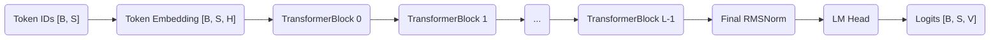
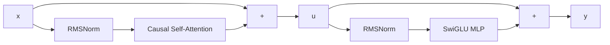

> [GitHub | Euler0525/ai-infra-learning](https://github.com/Euler0525/ai-infra-learning)

TransformerBlock 是 Decoder-only 大语言模型的核心计算单元。Embedding 负责把 token ID 映射成向量，LM Head 负责把最终隐藏状态映射回词表，而模型绝大部分参数、计算量和 KV Cache 都位于一层层重复堆叠的 TransformerBlock 中。

## TransformerBlock 在模型中的位置

一个完整的 Causal Language Model 可以拆成



这里 $B$ 表示 batch size，$S$ 表示 sequence length，$H$ 表示 hidden size，$L$ 表示层数，$V$ 表示词表大小。对于当前 Qwen2.5-0.5B，关键配置如下。

| 配置 | 符号 | 数值 |
|---|---:|---:|
| Hidden size | $H$ | 896 |
| TransformerBlock 数量 | $L$ | 24 |
| Query head 数量 | $N_q$ | 14 |
| Key/Value head 数量 | $N_{kv}$ | 2 |
| Head dimension | $D$ | 64 |
| MLP intermediate size | $I$ | 4864 |
| Vocabulary size | $V$ | 151936 |

Embedding 输出的 shape 是 $[B,S,H]$。每个 TransformerBlock 接收并返回完全相同的 shape，所以 24 层可以顺序堆叠。Block 内部会暂时把隐藏状态展开成多头 Attention 或更宽的 MLP 中间表示，但在离开 Block 前一定恢复到 $[B,S,H]$。

## Block 的总体结构

Qwen 使用 Pre-Norm 结构。一个 Block 可以写成两个连续的残差子层。

$$
u = x + Attention(RMSNorm(x))
$$

$$
y = u + MLP(RMSNorm(u))
$$

第一条路径负责 token 之间的信息交换，第二条路径负责每个 token 内部的非线性特征变换。Attention 和 MLP 都不直接替换输入，而是通过残差连接把增量写回主干。



对应代码位于 [`layers.py`](https://github.com/Euler0525/ai-infra-learning/blob/develop/mini_llm/model/layers.py)。第一次残差保存 Block 原始输入，第二次残差保存 Attention 输出与原输入相加后的结果。

```python
residual = hidden_states
hidden_states = self.input_layernorm(hidden_states)
hidden_states, _ = self.self_attn(
    hidden_states,
    position_embeddings,
    attention_mask,
)
hidden_states = residual + hidden_states

residual = hidden_states
hidden_states = self.post_attention_layernorm(hidden_states)
hidden_states = self.mlp(hidden_states)
return residual + hidden_states
```

两次残差不能混用。如果 MLP 输出错误地加回 Block 最初的输入，网络结构就不再等价于 Qwen 的 Decoder Layer，即使所有 Linear 权重完全一致，最终 logits 也会产生偏差。

## RMSNorm

RMSNorm 根据一个 token 隐藏向量的均方根进行归一化。设输入 $x∈R^H$，其计算过程为：

$$
RMS(x) = \sqrt{\frac{1}{H}\sum_{i = 1}^{H}x_i^2 + \epsilon}
$$

$$
RMSNorm(x) = \gamma \odot \frac{x}{RMS(x)}
$$

$\gamma∈R^H$ 是可训练缩放参数，$\epsilon$ 是防止除零的极小常数，Qwen 使用 $10^{-6}$。符号 $\odot$ 表示逐元素乘法。

RMSNorm 与 LayerNorm 的主要区别是它不减去均值，也不使用可训练 bias。LayerNorm 同时控制均值与方差，RMSNorm 只控制向量整体尺度，因此计算路径更短。

项目中的 [`RMSNorm`](https://github.com/Euler0525/ai-infra-learning/blob/develop/mini_llm/model/layers.py) 先把输入转换成 float32，再进行平方、Reduction 和平方根倒数运算。

```python
input_dtype = hidden_states.dtype
float_states = hidden_states.to(torch.float32)
variance = float_states.pow(2).mean(dim=-1, keepdim=True)
normalized = float_states * torch.rsqrt(variance + self.eps)
return self.weight * normalized.to(input_dtype)
```

模型权重可能使用 BF16，但 Reduction 会累加 $H$ 个平方值。如果全程使用低精度，舍入误差会随 hidden size 增大。使用 float32 累积后再转回输入 dtype，能够与 Hugging Face 的 Qwen2RMSNorm 保持一致。

RMSNorm 包含逐元素平方、Reduction、`rsqrt` 和逐元素缩放。它通常是 memory-bound 算子，优化重点不是增加复杂计算，而是减少全局内存访问、让读取连续合并，并在一个 Kernel 内完成 Reduction 与归一化，避免保存不必要的中间 Tensor。

## Rotary Position Embedding

Self-Attention 本身只计算 token 向量之间的相似度。如果调换两个 token 的位置而不提供位置信息，Attention 无法区分它们的先后顺序。RoPE 不把位置向量直接加到 hidden states，而是根据位置旋转 Query 和 Key，使它们的点积自然携带相对位置信息。

### 频率构造

设每个 head 的维度为 $D$，RoPE 基数为 $\theta$。不同维度使用不同的逆频率：

$$
inv\_freq_i = \frac{1}{\theta^{2i/D}}
$$

位置 $p$ 对应的旋转角度为：

$$
angle_{p, i} = p \times inv\_freq_i
$$

Qwen2.5 使用 $\theta=1000000$。低维分量旋转较快，高维分量旋转较慢，使模型能够同时表达短距离和长距离位置关系。

[`RotaryEmbedding`](https://github.com/Euler0525/ai-infra-learning/blob/develop/mini_llm/model/attention.py) 使用 float32 生成角度、cosine 和 sine，最后转换回 hidden states 的 dtype。位置越长，低精度浮点数越难准确表示角度，因此频率计算不能轻易降到 BF16。

### 旋转操作

项目采用 Qwen 的 split-half 旋转形式。把最后一个维度拆成两半：

$$
x = [x_1, x_2]
$$

定义：

$$
rotate\_half(x) = [-x_2, x_1]
$$

最终旋转为：

$$
RoPE(x) = x \odot cos(angle) + rotate\_half(x) \odot sin(angle)
$$

RoPE 只作用于 Query 和 Key，不作用于 Value。位置应影响“当前 Query 应该关注哪个 Key”，而 Value 负责承载被读取的内容。

Query 的 shape 是 $[B,N_q,S,D]$，cosine 和 sine 的 shape 是 $[1,S,D]$。代码插入 head 维度后得到 $[1,1,S,D]$，再利用广播同时作用于所有 batch 和 head。

## Grouped-query Attention

### Q/K/V Projection

Attention 输入是 $X∈R^{B×S×H}$。首先通过三个线性层产生 Query、Key 和 Value。

$$
Q = XW_Q + b_Q
$$

$$
K = XW_K + b_K
$$

$$
V = XW_V + b_V
$$

对于 Qwen2.5-0.5B，$H=896$、$N_q=14$、$N_{kv}=2$、$D=64$。因此 Query projection 输出宽度是 $14×64=896$，Key 和 Value projection 输出宽度都是 $2×64=128$。

以 $B=1$、$S=4$ 为例，shape 变化如下。

| Tensor | Projection 后 | 调整 head 维度后 |
|---|---|---|
| Query | $[1,4,896]$ | $[1,14,4,64]$ |
| Key | $[1,4,128]$ | $[1,2,4,64]$ |
| Value | $[1,4,128]$ | $[1,2,4,64]$ |

项目实现中 Q/K/V projection 使用 bias，O projection 不使用 bias，MLP 的三个 projection 也不使用 bias。这些细节必须与目标模型完全一致，否则 `state_dict` 即使能加载，计算也无法对齐。

### GQA 的共享方式

传统 Multi-head Attention 为每个 Query head 配置独立的 Key 和 Value head，因此通常有 $N_q=N_{kv}$。Qwen 使用 Grouped-query Attention，14 个 Query heads 只配备 2 个 Key/Value heads。

每个 K/V head 服务的 Query head 数量为：

$$
G = \frac{N_q}{N_{kv}} = \frac{14}{2} = 7
$$

[`repeat_key_value`](https://github.com/Euler0525/ai-infra-learning/blob/develop/mini_llm/model/attention.py) 将 $[B,2,S,64]$ 逻辑扩展为 $[B,14,S,64]$。实现先插入 group 维度得到 $[B,2,1,S,64]$，通过 `expand` 形成 $[B,2,7,S,64]$，最后 reshape 为 $[B,14,S,64]$。

`expand` 表达的是共享关系，不会像直接复制那样立刻分配七倍底层存储。真正的 KV Cache 仍只需要保存 2 个 K/V heads，这正是 GQA 对 Decode 性能的价值。

### KV Cache 成本

每一层、每个 token 的 KV Cache 元素数量为：

$$
KV\_elements = 2 \times N_{kv} \times D
$$

前面的 2 分别代表 Key 和 Value。Qwen2.5-0.5B 使用 BF16，每个元素占 2 bytes，因此每层每 token 的理论存储量为：

$$
2 \times 2 \times 64 \times 2 = 512\ \mathrm{bytes}
$$

24 层合计约为：

$$
512 \times 24 = 12288\ \mathrm{bytes} \approx 12\ \mathrm{KiB/token}
$$

如果使用 14 个 K/V heads 的传统 MHA，同样计算约为 84 KiB/token，正好是 GQA 的 7 倍。这里没有计入 allocator 对齐、元数据和框架对象开销，但可以展示 GQA 为什么适合长上下文推理。

## Causal Attention

### 因果约束

Decoder-only 模型生成当前位置 token 时不能读取未来 token。长度为 4 时，允许访问的位置如下。

| Query 位置 | 可读取的 Key 位置 |
|---:|---|
| 0 | 0 |
| 1 | 0, 1 |
| 2 | 0, 1, 2 |
| 3 | 0, 1, 2, 3 |

[`build_causal_attention_mask`](https://github.com/Euler0525/ai-infra-learning/blob/develop/mini_llm/model/attention.py) 创建 shape 为 $[B,1,S,S]$ 的加法 mask。主对角线上方填入当前 dtype 的最小有限值，其他位置为 0。head 维度保留为 1，计算时广播到所有 Query heads。使用最小有限值而不是简单乘以 0，是因为 mask 在 softmax 之前加到 Attention score 上。被屏蔽位置得到极大的负数，指数结果接近 0。

### Scaled Dot-product Attention

应用 RoPE 并扩展 K/V heads 后，Attention score 为：

$$
Scores = \frac{QK^T}{\sqrt{D}} + Mask
$$

这里除以 $\sqrt{D}$ 是为了控制点积方差。若 Query 和 Key 各维度具有相近方差，点积规模会随 $D$ 增长，softmax 容易过早饱和。当前 $D=64$，缩放系数是 $1/8=0.125$。

随后计算概率和输出：

$$
P = softmax(Scores)
$$

$$
Context = PV
$$

score 和概率的 shape 是 $[B,N_q,S,S]$，Context 的 shape 是 $[B,N_q,S,D]$。Context 转置并 reshape 回 $[B,S,H]$，再经过 O projection 得到 Attention 子层输出。

softmax 强制使用 float32：

```python
attention_weights = torch.softmax(
    attention_weights,
    dim=-1,
    dtype=torch.float32,
).to(query.dtype)
```

指数运算对数值范围敏感，BF16/FP16 更容易发生精度损失。未来替换为融合 Attention Kernel 时，必须把这种累积和归一化精度纳入 correctness 标准。

## SwiGLU MLP

Attention 负责 token 之间的信息交换，MLP 负责对每个 token 的特征独立进行非线性变换。Qwen 使用 SwiGLU，而不是简单的两层 Linear 加 ReLU。

$$
Gate = SiLU(XW_{gate})
$$

$$
Up = XW_{up}
$$

$$
MLP(X) = (Gate \odot Up)W_{down}
$$

其中：

$$
SiLU(x) = x \times sigmoid(x)
$$

输入和输出 shape 都是 $[B,S,896]$，Gate 和 Up 的中间 shape 是 $[B,S,4864]$。两条投影分支逐元素相乘后，通过 Down projection 回到 hidden size。

[`SwiGLUMLP`](https://github.com/Euler0525/ai-infra-learning/blob/develop/mini_llm/model/layers.py) 的实现保持三个 Linear 层彼此独立，因为它们对应 Hugging Face 权重中的 `gate_proj`、`up_proj` 和 `down_proj`。生产 Kernel 可以把 Gate 和 Up projection 合并成一次更宽的 GEMM，但 reference 实现首先追求结构透明和权重一一对应。

## 参数分布

Qwen2.5-0.5B 的单个 TransformerBlock 大约包含 1491 万参数。Attention、MLP 和 Norm 的参数量可以按矩阵 shape 直接计算。

| 组件 | 参数量 |
|---|---:|
| Q/K/V/O projection 与 Q/K/V bias | 1,836,160 |
| Gate/Up/Down projection | 13,074,432 |
| 两个 RMSNorm | 1,792 |
| 单个 Block 合计 | 14,912,384 |

24 个 Block 约包含 3.58 亿参数。Embedding 与绑定的 LM Head 约包含 1.36 亿参数，因此总量接近 4.94 亿，符合 0.5B 模型的命名。参数分布也说明 MLP GEMM 是模型 FLOPs 的重要来源，而 Decode 阶段的 Attention 还要持续读取不断增长的 KV Cache。优化 TransformerBlock 不能只关注单一算子，需要区分 Prefill 和 Decode 的瓶颈。

## Prefill 与 Decode 中的 Block

### Prefill

Prefill 一次输入完整 prompt。若 prompt 长度为 $S$，每个 Block 接收 $[B,S,H]$，计算所有 token 的 Q/K/V，并为本层建立长度为 $S$ 的 KV Cache。

Attention score 的 shape 是 $[B,N_q,S,S]$，其计算量随序列长度近似按 $S^2$ 增长。此阶段包含较大的矩阵乘法，GPU 通常更容易获得较高利用率。

### Decode

Decode 每轮只输入一个新 token，因此当前输入 shape 是 $[B,1,H]$。但是每层仍然需要生成新 token 的 Query、Key 和 Value，把新的 K/V 追加到该层缓存，并让 Query 读取此前所有 $S$ 个历史 K/V。

每个生成 token 都必须依次经过 24 个 Block。Decode 中的小 GEMM、Kernel launch 和 KV Cache 读取更突出，通常比 Prefill 更容易受到内存带宽和调度开销限制。

### 每层独立缓存

KV Cache 不是整个模型共享的一份缓存。每个 Block 的投影权重不同，产生的 K/V 表示也不同，因此模型需要维护 Layer 0 到 Layer 23 各自独立的 KV Cache。

现有 [`engine/generation.py`](../mini_llm/engine/generation.py) 把 Hugging Face 返回的 `past_key_values` 作为整体状态保存，内部实际上包含每一层的 K/V。Prefill 建立缓存，Decode 每轮读取并更新它。

## 总结

TransformerBlock 是原先 Hugging Face Qwen 模型内部 `model.model.layers[i]` 的显式实现。每个 Block 通过 RMSNorm、RoPE、Grouped-query Attention、SwiGLU MLP 和两次残差连接，把输入 $[B,S,H]$ 变换成同 shape 的输出。24 个 Block 顺序堆叠后，Final RMSNorm 和 LM Head 才产生词表 logits。

理解这一层的 shape、数值精度、KV Cache 和 Prefill/Decode 行为，是继续学习 LLM Runtime 与 GPU Kernel 的连接点。上层 Runtime 决定请求和缓存如何组织，底层 Kernel 决定 Block 中每一次 Reduction、GEMM、Softmax 和内存访问如何高效执行。

## 参考资料

[Hugging Face | Qwen/Qwen2.5-0.5B-Instruct](https://huggingface.co/Qwen/Qwen2.5-0.5B-Instruct)

[GitHub | Euler0525/ai-infra-learning](https://github.com/Euler0525/ai-infra-learning)

## 附录

### TransformerBlock 对应关系

| Hugging Face Qwen2 | 项目参考实现 |
|:--|:--|
| `Qwen2RMSNorm` | `RMSNorm` |
| `Qwen2RotaryEmbedding` | `RotaryEmbedding` |
| `Qwen2Attention` | `CausalSelfAttention` |
| `Qwen2MLP` | `SwiGLUMLP` |
| `Qwen2DecoderLayer` | `TransformerBlock` |
| `Qwen2Model` | `QwenDecoder` |
| `Qwen2ForCausalLM` | `TorchReferenceQwen` |

