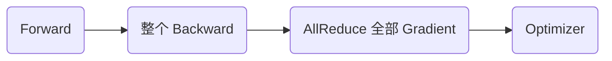

从一个 Decoder-only Transformer 的输入张量出发：

$$
X\in\mathbb{R}^{B\times S\times H}
$$

其中 $B$ 是 Batch Size，$S$ 是 Sequence Length，$H$ 是 Hidden Size。若模型有 $L$ 个 Transformer Layer，MoE 层有 $E$ 个 Expert，则可以把现代大模型并行理解为沿以下几类维度进行切分：

$$
\underbrace{B}_{DP}
\times
\underbrace{S}_{CP/SP}
\times
\underbrace{H}_{TP}
\times
\underbrace{L}_{PP}
\times
\underbrace{E}_{EP}
$$

对应六种主流并行策略

| 并行策略      | 核心切分维度        | 主要解决问题                          | 典型通信                              |
| :------------ | :------------------ | :------------------------------------ | :------------------------------------ |
| 数据并行 DP   | Batch               | 提高吞吐、扩展训练规模                | AllReduce / ReduceScatter / AllGather |
| 张量并行 TP   | Hidden / Head / FFN | 单层参数或计算过大                    | AllReduce / ReduceScatter / AllGather |
| 流水线并行 PP | Layer               | 模型层数太多、整模型放不下            | P2P Send / Recv                       |
| 上下文并行 CP | Sequence / Context  | 长上下文 Activation 与 Attention 计算 | Ring P2P / AllGather / AllToAll       |
| 专家并行 EP   | Expert              | MoE Expert 参数规模过大               | AllToAll                              |
| 序列并行 SP   | Sequence            | 降低 TP 域中重复 Activation           | AllGather / ReduceScatter             |

Hugging Face 的 [Model Parallelism](https://huggingface.co/docs/transformers/v4.15.0/parallelism) 把 TP 描述为对 Tensor 的“横向切分”，PP 描述为沿 Layer 的“纵向切分”；进一步组合 DP、TP、PP 后，就得到经典的 3D Parallelism。

## 并行训练的通信问题

### 统一的 $\alpha$-$\beta$ 通信模型

分布式通信耗时可以近似写成：

$$
T_{comm}=\alpha N_{msg}+\beta V
$$

其中：

- $\alpha$：每次通信的启动延迟；
- $N_{msg}$：消息或 Collective 的次数；
- $\beta$：单位字节传输时间，可以近似理解为带宽倒数；
- $V$：实际传输的数据量。

这意味着通信瓶颈存在两个完全不同的方向。

一类是 **Latency Bound**：Tensor 不大，但 Collective 调得非常频繁，例如高 TP Degree 下每层频繁执行 Collective；另一类是 **Bandwidth Bound**：通信次数不多，但一次要搬运大量参数、梯度或 Token，例如 DP Gradient Reduce、FSDP Parameter AllGather、MoE AllToAll。

以 Ring AllReduce 为例，对大小为 $M$ 的 Tensor，在 $N$ 个 Rank 上每个 Rank 的理论通信量约为：

$$
V_{AR}= 2\frac{N-1}{N}M
$$

原因是 Ring AllReduce 可以拆成：

$$
\text{AllReduce}=\text{ReduceScatter}+\text{AllGather}
$$

每一半的数据量约为：

$$
\frac{N-1}{N}M
$$

### Visible Communication

完全消灭通信通常不现实。更实际的目标是让通信与计算重叠：

$$
T_{step}\approx
T_{compute}+T_{visible\_comm}+T_{bubble}+T_{imbalance}
$$

如果通信能被 GEMM、Attention 或 Backward 覆盖，那么即使总字节数没有下降，端到端训练时间也可能明显下降。

因此很多工程优化的本质都是：

$$
T_{visible\_comm}\rightarrow 0
$$

## 数据并行 DP

### DP 的实现机制

Data Parallelism 的基本思想最简单：每张 GPU 保存相同的完整模型，数据拆成多份不同 GPU 处理不同的数据。因此 DP 主要解决吞吐问题，不能解决单卡模型显存的问题

如果模型参数为 $\theta$，初始化时

$$
\theta_0^{(0)}=\theta_0^{(1)}=\theta_0^{(2)}=\theta_0^{(3)}
$$

只是每个 GPU 处理的数据不同，DP 切分的是 Batch Dimension 而不是模型本身。

在 Forward 阶段，几乎完全独立，假设一个 Global Batch 为 $B$，DP Degree 为 $D$，则每个 GPU 的 Local Batch 为 $B_{local} = \frac{B}{D}$，假设原始输入为

$$
X \in \mathbb{R}^{128\times S\times H}
$$

DP 之后

$$
\begin{aligned}
\text{GPU0}&: X_0 ∈ R^{32 × S × H}\\
\text{GPU1}&: X_1 ∈ R^{32 × S × H}\\
\text{GPU2}&: X_2 ∈ R^{32 × S × H}\\
\text{GPU3}&: X_3 ∈ R^{32 × S × H}
\end{aligned}
$$

每张卡独立处理 $Y_i = f(X_i;\theta)$，整个 Forward 阶段，GPU 之间几乎不需要交流。

在 Backward 阶段，每张 GPU 得到的 梯度不同。每张 GPU 独立计算：

$$
g_i =\frac{\partial L_i}{\partial \theta}
$$

为了保证每张 GPU 使用相同的全局梯度，计算

$$
g =\frac{1}{D}\sum_{i = 0}^{D-1}g_i
$$

所有卡使用相同的 $g$ 更新 $\omega'=\omega - \eta g$，模型继续保持一致。这一步是 DP 最核心的通信 `AllReduce`。

> 下证 DP 在数学上等价于 大 Batch 单卡训练。
>
> 损失定义为 Batch 平均
>
> $$
> L = \dfrac{1}{B} \sum_{j = 1}^{B} \mathit{l}(x_j;\theta)
> $$
>
> 梯度
>
> $$
> \grad_{\theta} L = \dfrac{1}{B} \sum_{j = 1}^{B} \grad_{\theta}\mathit{l}(x_j;\theta)
> $$
>
> 现在用 D 张 GPU，每张 GPU 拿到 $B_{\text{local}}=\dfrac{B}{D}$ 个样本，第 $i$ 张 GPU 的局部梯度为
>
> $$
> g_i = \dfrac{1}{B_{\text{local}}} \sum_{x_j\in \mathcal{B}_i} \grad_{\theta}\mathit{l}(x_j;\theta)
> $$
>
> 然后对所有的 GPU 的梯度求平均
>
> $$
> \begin{aligned}
> g &= \dfrac{1}{D}\sum_{i = 1}^D g_i\\
> &= \dfrac{1}{D} \sum_{i = 1}^D \dfrac{1}{B_{\text{local}}} \sum_{x_j\in \mathcal{B}_i} \grad_{\theta}\mathit{l}(x_j;\theta)\\
> &= \dfrac{1}{B} \sum_{j = 1}^{B} \grad_{\theta}\mathit{l}(x_j;\theta)
> \end{aligned}
> $$
>
> 等于单卡直接处理整个 Global Batch 得到的梯度，因此同步数据并行，本质上是在多张 GPU 上分布式计算一个更大的 Batch.

单卡处理 128 个样本与每张卡承担原来 $\frac{1}{4}$ 的运算，理论上

$$
T_{\text{compute}} \approx \dfrac{1}{4}T_{\text{single}}
$$

但是实际上还需要梯度通信

$$
T_{\text{step}} = T_{\text{forward}} + T_{\text{backward}} + T_{\text{communication}} + T_{\text{optimizer}}
$$

因此加速不可能达到 $4\times$，关键取决于

$$
\boxed{\dfrac{Compute}{Communication}}
$$

的比例。

---

每次参数对应只有一个梯度，因此 DP 通信的数据量大致和参数量有关。而计算量和 Local Batch Size 有关，因此

$$
B_{\text{local}} \uparrow \Rightarrow \dfrac{Compute}{Communication} \uparrow
$$

DP 更新欢每张 GPU 都有足够大的 Local Batch，通信更容易被隐藏。如果每张卡计算很少，但是仍然需要同步整个模型的梯度，GPU 数量增加反而没有意义了。

---


最朴素的计算与通信流程是



这样会导致 $T_{\text{step}} = T_{\text{compute}} + T_{\text{communication}}$，通信完全暴露在关键路径上。实际上，Backward 是逐层进行的，完成一层的梯度计算之后就可以开始通信了，实现计算与通信的时间重叠。

```text
Layer4 backward
      ↓
Gradient ready
      └──────── AllReduce Layer4 ────────┐
                                         │
Layer3 backward                          │
                                         │
Layer2 backward                          │
```

理想情况下 $T \approx \max(T_{\text{backward}}, T_{\text{commmunication}})$ 而不是 $T \approx T_{\text{backward}} + T_{\text{commmunication}}$.

> 根据统一的 $\alpha$-$\beta$ 通信模型，不能每算出一个参数梯度就执行一次 AllReduce，DP 会把多个 Gradient 放进一个 Bucket，满了之后执行 `AllReduce(bucket)`.
>
> 需要平衡的是
>
> Bucket 太小 → 通信启动次数太多 → latency 高
>
> Bucket 太大 → 必须等更多梯度 ready → overlap 机会下降

### DP 的通信量

假设模型参数量为 $P$，每个 Gradient 元素占 $b$ Bytes，则整个 Gradient 大小为

$$
M_g = Pb
$$

如果直接使用 Ring AllReduce，$D$ 张 GPU 中每张 GPU 的通信量约为

$$
V = 2\dfrac{D-1}{D}M_{g}
$$

### ZeRO / FSDP

传统 DDP 最大的问题是每个 Rank 都保存完整 Parameter、Gradient 与 Optimizer State。ZeRO/FSDP 在仍然保持数据并行语义的前提下，把训练状态按 DP Rank 分片。

```text
ZeRO-1: Optimizer State sharded
ZeRO-2: Optimizer State + Gradient sharded
ZeRO-3 / FSDP: Parameter + Gradient + Optimizer State sharded
```

ZeRO-3 / FSDP 的 Forward 典型流程是：

```text
Parameter shard
      ↓
AllGather current layer parameters
      ↓
Forward GEMM
      ↓
Reshard / release full parameters
```

Backward 则需要再次恢复参数，并用 ReduceScatter 聚合并重新分片梯度。因此 ZeRO/FSDP 的本质是：

$$
\text{Memory}\downarrow
\quad\Longleftrightarrow\quad
\text{Parameter/Gradient Communication}\uparrow
$$

Hugging Face 的 [Model Parallelism](https://huggingface.co/docs/transformers/v4.15.0/parallelism) 用了一个非常形象的比喻：每个参与者只背一部分装备，需要使用某层时临时共享并重建完整参数，用完后再释放。

### DP 的优缺点

**优点**：模型计算图基本不需要修改；GPU 之间在 Forward/Backward 主体中相互独立；扩展到更多节点相对容易；通信可以通过 Gradient Bucket 与 Backward 高度重叠。

**缺点**：普通 DDP 不降低模型状态显存；DP Degree 过大时 Global Batch 容易变得过大；使用 FSDP/ZeRO-3 后虽然显存下降，但 Parameter AllGather 与 Gradient ReduceScatter 增加了通信压力。

## 张量并行 TP

数据并行 DP 是 **模型复制、数据切分**；张量并行 TP 是 **数据共享、模型切分**，也就是说把一个 Transformer Layer 内部的大矩阵拆到多张 GPU 上，让多张 GPU 共同完成同一个样本的计算。

考虑线性层：

$$
Y = XW
$$

其中：

$$
X\in\mathbb{R}^{M\times H_{in}},\qquad
W\in\mathbb{R}^{H_{in}\times H_{out}}
$$

### Column Parallel Linear

按输出维切 $W$：

$$
W = [W_0, W_1,\dots, W_{T-1}]
$$

每块：

$$
W_t\in\mathbb{R}^{H_{in}\times H_{out}/T}
$$

于是每个 TP Rank 独立计算：

$$
Y_t = XW_t
$$

得到：

$$
Y_t\in\mathbb{R}^{M\times H_{out}/T}
$$

因为输出维本来就被切开，所以这一阶段不需要立刻做求和通信。

### Row Parallel Linear

第二个 Linear 可以按输入维切：

$$
W =
\begin{bmatrix}
W_0\\W_1\\\vdots\\W_{T-1}
\end{bmatrix}
$$

其中：

$$
W_t\in\mathbb{R}^{H_{in}/T\times H_{out}}
$$

如果输入本来已经被 TP 切成 $X_t$，则每个 Rank 计算局部 partial output：

$$
Y_t = X_tW_t
$$

完整结果是：

$$
Y =\sum_{t = 0}^{T-1}Y_t
$$

因此需要 AllReduce；启用 Sequence Parallel 后，这里通常进一步改写成 ReduceScatter，把“求和”和“Sequence 分片”合并到同一个 Collective 中。

---

以两层 MLP 为例：

$$
Y =\operatorname{GELU}(XW_1)W_2
$$

让 $W_1$ Column Parallel，$W_2$ Row Parallel：

```text
X
│
├─ GPU0: XW1_0 → GELU → H0 → H0W2_0 ─┐
├─ GPU1: XW1_1 → GELU → H1 → H1W2_1 ─┤
├─ ...                                ├─ Sum / ReduceScatter
└─ GPU(T-1)                           ┘
```

中间的 GELU/SwiGLU 可以直接对各自 Shard 独立执行，因此不用在两个 Linear 中间重建完整 Tensor，Column Parallel 后不 Gather，而是直接接 Row Parallel，直到最后才 Reduce。

Hugging Face 的 [Model Parallelism](https://huggingface.co/docs/transformers/v4.15.0/parallelism) 也用相同的矩阵视角解释 TP：先按列切第一个权重矩阵，使不同 GPU 的输出可以独立经过 GeLU，再在需要恢复完整语义的位置进行同步。

---

Multi-Head Attention：

$$
Q = XW_Q,\qquad K = XW_K,\qquad V = XW_V
$$

多个 Attention Head 本身相互独立。若总 Head 数为 $N_h$，TP Degree 为 $T$，理想情况下每个 Rank 负责：

$$
N_h^{local}=\frac{N_h}{T}
$$

个 Head。

QKV Projection 使用 Column Parallel，Output Projection 使用 Row Parallel：

```text
X
│
├─ QKV heads shard 0 → Attention heads shard 0 ─┐
├─ QKV heads shard 1 → Attention heads shard 1 ─┤
├─ ...                                          ├─ Output Projection partial sum
└─ QKV heads shard T-1                          ┘
```

因此 Transformer Block 中 TP 的 Collective 通常集中在 Attention Output 与 MLP Output 附近，而不是每一个 Linear 都 Gather 完整 Tensor。

### TP 的通信特征

TP 的最大问题不是总通信量，而是通信发生在 **每一层的 Critical Path** 上：

```text
GEMM
 ↓
Collective
 ↓
GEMM
 ↓
Collective
 ↓
Next Transformer Layer
```

几十甚至上百层会不断重复这一模式。因此 TP 需要非常快的网络，实践中通常尽量不要把一个 TP Group 跨越慢速节点互联。TP 应优先放进 NVLink/NVSwitch 域，并只扩到足够解决单层显存与计算问题的程度。

TP Degree 继续增大时，每个 Rank 上 GEMM 变小，Tensor Core 利用率下降，而 Collective Latency 并不会同比下降，最终会出现 Scaling Saturation。

## 流水线并行 PP

如果 Transformer 的层数较多，单张 GPU 放不下，PP 把 Transformer 的层沿深度分到不同 Stage：

```text
Stage 0: Layer  0 ~  7
Stage 1: Layer  8 ~ 15
Stage 2: Layer 16 ~ 23
Stage 3: Layer 24 ~ 31
```

Stage 之间只需要传 Boundary Activation，Backward 再反向传递 dActivation。

### Naive Model Parallel

如果整个 Batch 一次走完：

```text
time →
GPU0: █████████
GPU1:          █████████
GPU2:                   █████████
GPU3:                            █████████
```

任意时刻大多数 GPU 都空闲，GPU 的李功率可能很差。Hugging Face 文档把这称为 Naive Vertical Model Parallel：它能够扩展显存，但没有真正利用所有 GPU 的并发算力。

### Micro-Batch

PP 把一个 Mini-Batch 再切成多个 Micro-Batch：

```text
time →
GPU0: M0 M1 M2 M3 M4 ...
GPU1:    M0 M1 M2 M3 M4 ...
GPU2:       M0 M1 M2 M3 M4 ...
GPU3:          M0 M1 M2 M3 M4 ...
```

若

- Micro-Batch Size 为 $B_\mu$；
- Micro-Batch 数为 $M$；
- DP Degree 为 $D$；

则 Global Batch Size 为：

$$
B_{global}= B_\mu\times M\times D
$$

### Pipeline Bubble

即使加入了 Micro Batch，也无法做到一开始所有 GPU 都满载。一开始

```text
GPU0 M0
GPU1 IDLE
GPU2 IDLE
GPU3 IDLE
```

过了一段时间，流水线才完全填满，结束时也会逐渐排空。因为流水线填充与排空产生的空闲时间称为流水线空泡。

对于 $P$ 个 Stage、$M$ 个 Micro-Batch，简单 Forward Pipeline 的空泡比例可近似写成：

$$
\text{Bubble}\approx\frac{P-1}{M+P-1}
$$

因此通常希望：

$$
M\gg P
$$

但 Micro-Batch 也不能无限变小，因为 GEMM 的 $M$ 维变小后，Arithmetic Intensity 与 Tensor Core Utilization 会下降。

这形成 PP 的核心调优矛盾：

$$
\text{更多 Micro-Batch}\Rightarrow\text{Bubble 更小}
$$

但：

$$
\text{更小 Micro-Batch}\Rightarrow\text{单次 GEMM 效率可能更差}
$$

### 1F1B 与 Interleaved Pipeline

Forward 与 Backward 的方向正好相反

```text
Forward: 
stage0 -> stage1 -> stage2 -> stage3
GPU0   -> GPU1   -> GPU2   -> GPU3
Backward:
stage0 <- stage1 <- stage2 <- stage3
GPU0   <- GPU1   <- GPU2   <- GPU3
```

Forward Stage 之间传递的是 $Activation$，而 Backward Stage 之间传递的是 $\dfrac{\partial L}{\partial Activation}$.如果所有 MIcro Batch 全部 Forward 完成再统一 Backward，会导致 Activation Memory 很大

现代训练通常使用 1F1B：在 Steady State 中一个 Stage 交替执行 Forward 和 Backward，避免一次保存所有 Micro-Batch 的 Forward Activation。

```text
Warmup → F F F
             B F B F B F ...
                        → Cooldown
```

进一步使用 Virtual Pipeline / Interleaved 1F1B，可以让一个 Physical Stage 持有多个不连续 Layer Chunk，从而降低 Bubble，但代价是更多 P2P 调度与更复杂的 Activation 生命周期。

### PP 的通信特征

PP 中每个 Stage 需要和相邻的 Stage 交换数据

```text
Stage0
  ↓ Activation ↑ dActivation
Stage1
  ↓ Activation ↑ dActivation
Stage2
```

所以核心的通信原语是 **Point-to-Point/Recv**

如果 Boundary Activation 大小为

$$
A = B_\mu S H b
$$

Forward 发送一次 $A$，Backward 再发送对应相同大小的梯度。因此 PP 的通信主要与 Micro-Batch Boundary Activation 有关，而不是每层都执行 Collective。$M$ 个 Micro Batch，大约

$$
V_{PP} = 2MA = 2MB_{\mu}SHb
$$

这也是为什么 PP 通常比 TP 更适合跨节点扩展：它的通信频率低得多，主要是相邻 Stage 的 P2P。

每一层计算可能并不相同，因此每个 Stage 的耗时不同，流水线吞吐主要由最慢 Stage 决定

$$
T_{\text{pipeline}}\approx \max_{i} T_i
$$

合理的切分目标是

$$
T_{\text{stage}_0}\approx T_{\text{stage}_1}\approx \cdots \approx T_{\text{stage}_{P-1}}
$$
